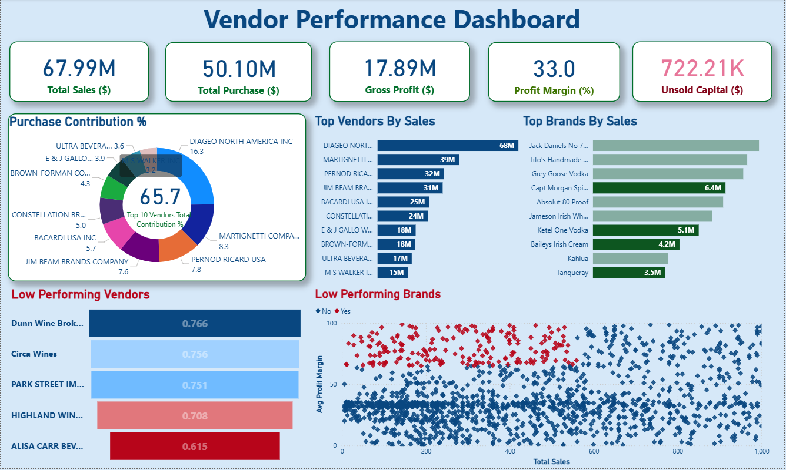

# 🧾 Sales & Vendor Performance Analytics


_Data-driven analysis of sales, vendor performance, and profitability to support strategic purchasing and inventory decisions using SQL, Python, and Power BI._

---

## 📌 Table of Contents
- <a href="#overview">Overview</a>
- <a href="#business-problem">Business Problem</a>
- <a href="#dataset">Dataset</a>
- <a href="#tools--technologies">Tools & Technologies</a>
- <a href="#project-structure">Project Structure</a>
- <a href="#data-cleaning--preparation">Data Cleaning & Preparation</a>
- <a href="#exploratory-data-analysis-eda">Exploratory Data Analysis</a>
- <a href="#key-insights">Key Insights</a>
- <a href="#dashboard">Dashboard</a>
- <a href="#how-to-run-this-project">How to Run This Project</a>
- <a href="#final-recommendations">Final Recommendations</a>

---

<h2 id="overview">Overview</h2>

This project analyzes **sales, vendor performance, and inventory data** to generate actionable business insights.  
The objective is to understand **vendor contribution to revenue and profitability**, identify **cost inefficiencies**, and highlight **inventory risks** that impact business performance.

The workflow combines **SQL for data preparation**, **Python for analysis**, and **Power BI for visualization**, simulating a real-world business analytics project.

---

<h2 id="business-problem">Business Problem</h2>

Retail businesses often struggle with:
- Vendors that generate revenue but reduce profitability
- Overstocked or slow-moving inventory
- Inefficient bulk purchasing decisions
- High dependency on a small number of vendors

This project evaluates vendor and sales performance to support **better purchasing, pricing, and inventory decisions**.

---

<h2 id="dataset">Dataset</h2>

- Multiple CSV files stored in the `/data` directory:
  - Sales transactions
  - Vendor information
  - Inventory data
- A consolidated vendor-level summary table is created for analysis

---

<h2 id="tools--technologies">Tools & Technologies</h2>

- **SQL** – Data extraction, joins, aggregations, and filtering  
- **Python** – Pandas, Matplotlib, Seaborn, SciPy  
- **Power BI** – Interactive dashboards and performance visuals  
- **GitHub** – Version control and project documentation  

---

<h2 id="project-structure">Project Structure</h2>

```
sales-vendor-performance-analytics/
├── README.md
├── .gitignore
├── requirements.txt
├── notebooks/
   ├── Exploratory Data Analysis.ipynb
   └── Vendor Performance Analysis.ipynb
├── scripts/
   ├── ingestion_db.py
   └── get_vendor_summary.py
├── dashboard/
   └── vendor_performance_dashboard.pbix
├── images/
   ├── project_workflow.png
   ├── dashboard_glimpse_1.png
   └── dashboard_glimpse_2.png
```

---

<h2 id="data-cleaning--preparation">Data Cleaning & Preparation</h2>

- Removed transactions with:
  - Gross Profit ≤ 0
  - Profit Margin ≤ 0
  - Sales Quantity = 0
- Standardized data types and handled outliers
- Created vendor-level aggregated metrics for analysis

---

<h2 id="exploratory-data-analysis-eda">Exploratory Data Analysis</h2>

Key observations from EDA include:

- Presence of **loss-making transactions**
- **Unsold inventory**, indicating slow-moving products
- Large **outliers in freight costs and pricing**
- Correlation analysis showed:
  - Strong link between purchase quantity and sales quantity
  - Weak relationship between purchase price and profitability
  - Negative relationship between sales price and profit margin

---

<h2 id="key-insights">Key Insights</h2>

- Several brands show **high margins but low sales**, indicating promotion opportunities  
- Top vendors account for a **large share of total purchases**, creating dependency risk  
- Bulk purchasing leads to **significant per-unit cost savings**  
- A high value of inventory remains **unsold**, impacting working capital  
- Vendor profitability varies significantly, confirming **different vendor strategies**

---

<h2 id="dashboard">Dashboard</h2>

An interactive **Power BI dashboard** was developed to visualize:
- Vendor-wise sales and profit margins
- Inventory turnover patterns
- Bulk purchase savings
- Performance heatmaps for quick comparison



---

<h2 id="how-to-run-this-project">How to Run This Project</h2>

1. Clone the repository:
```bash
git clone https://github.com/MasthanShaik-2301/sales-vendor-performance-analytics.git
```
2. Load the CSVs and ingest into database:
```bash
python scripts/ingestion_db.py
```
3. Create vendor summary table:
```bash
python scripts/get_vendor_summary.py
```
4. Open and run notebooks:
   - `Notebooks/Exploratory Data Analysis.ipynb`
   - `Notebooks/Vendor Performance Analysis.ipynb`
5. Open Power BI Dashboard:
   - `Dashboard/Vendor_Performance_Analysis_dashboard.pbix`
---
<h2><a class="anchor" id="final-recommendations"></a>Final Recommendations</h2>

- Diversify vendor base to reduce risk
- Optimize bulk order strategies
- Reprice slow-moving, high-margin brands
- Clear unsold inventory strategically
- Improve marketing for underperforming vendors

---
<h2><a class="anchor" id="author--contact"></a>Author & Contact</h2>

**Masthan Shaik**  
Data Analyst  
📧 Email: masthanshaik2201@gmail.com.com 
